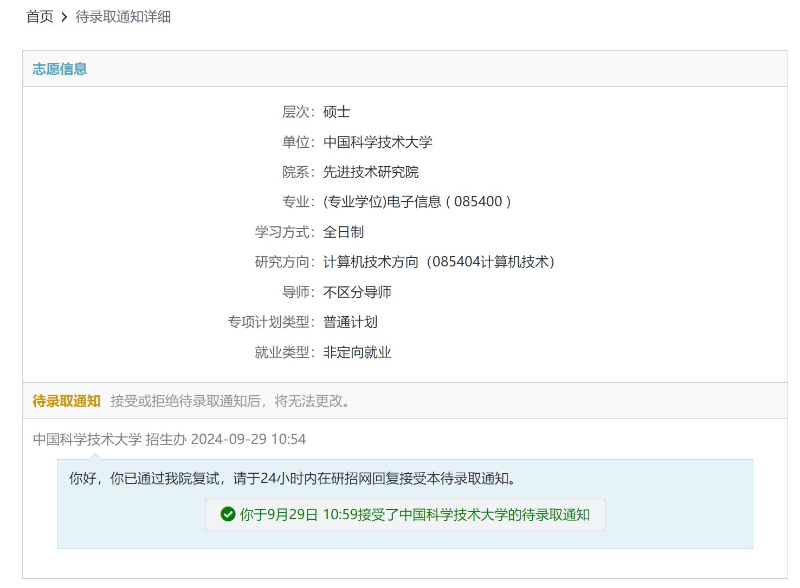
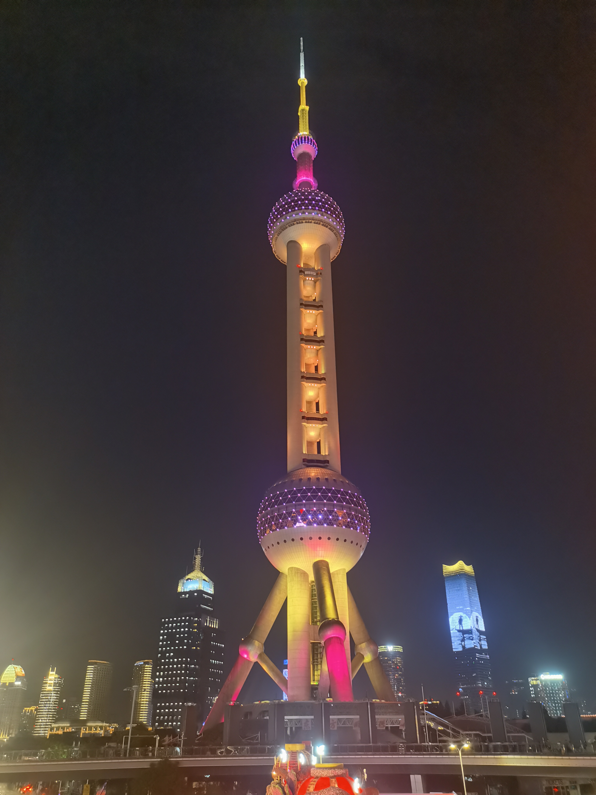
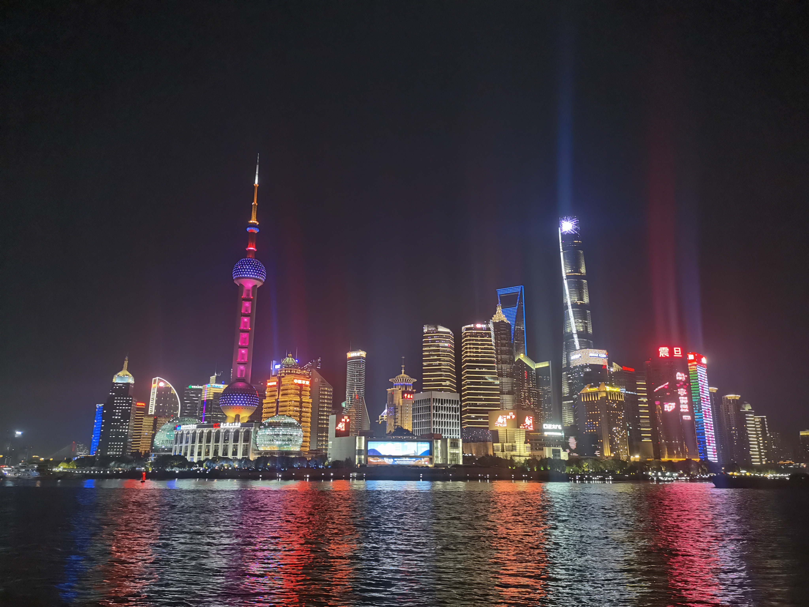
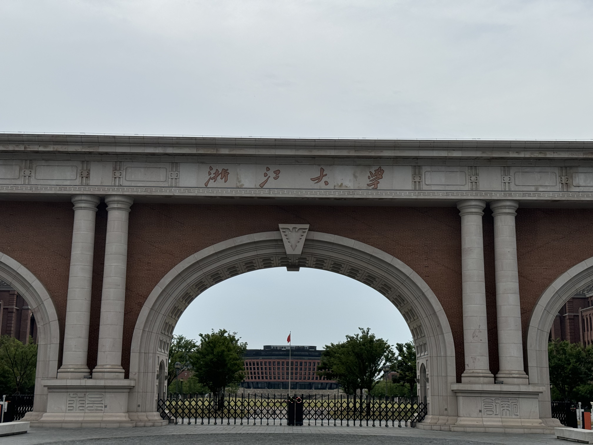
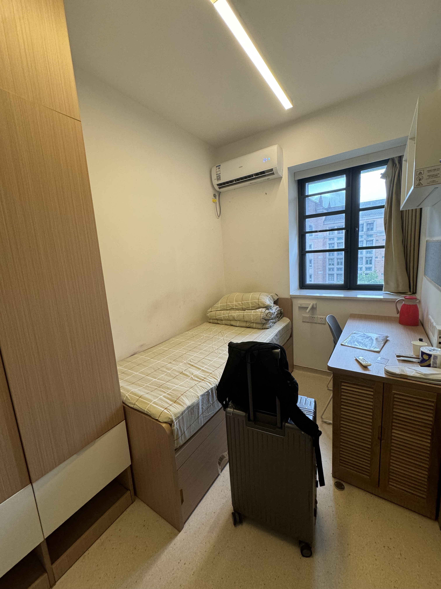
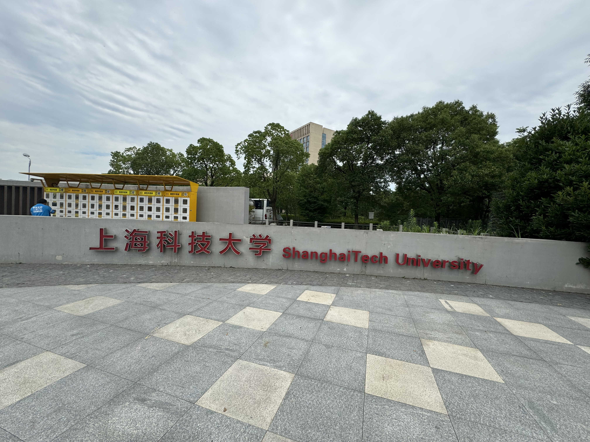
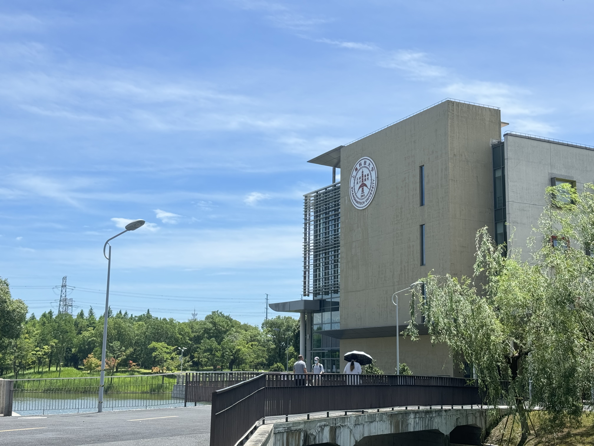
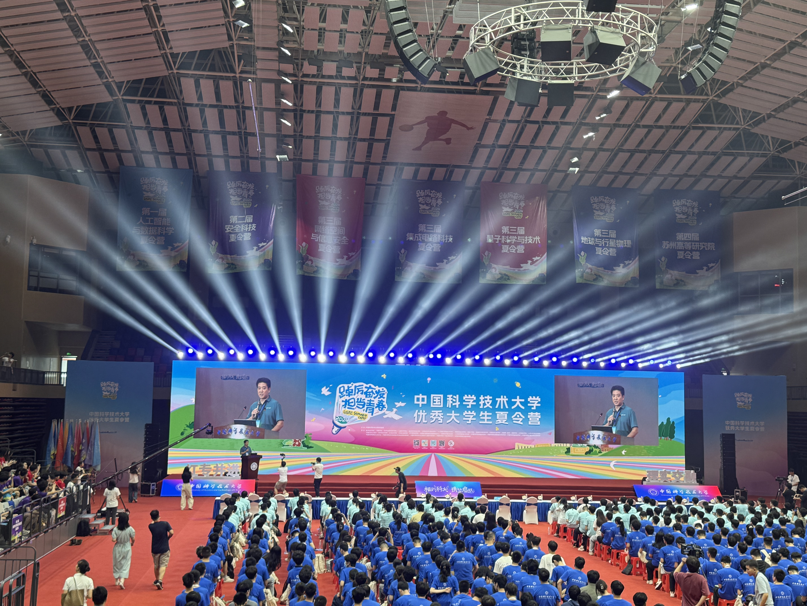

最终去向：

<!--more-->

## 个人背景

rk： UESTC SE 14%

英语： CET-4: 596 | CET-6: 556

科研： 一篇交通学交叉会议三作，一篇 AAAI 共一在投

竞赛： 无竞赛

奖学金： 电子科大优秀学生奖学金\*2，企业奖学金\*1，无果酱

## 夏令营

夏令营是高rk✌的战场，我采取的策略就是海投+投竞争不是那么强烈的学院与交叉学科，下文会有提到。
海投了n个学校，如下表所示：

| 学校                  | 学院                  | 是否入营 | 是否参加 | 是否优营 |
| --------------------- | --------------------- | -------- | -------- | -------- |
| CUHK sz               | SDS MAIR              | ✅        | ✅        | ✅        |
| 上海科技大学          | 信息科学与技术学院    | ✅        | ✅        | ✅        |
| 清华大学              | 深圳国际研究生院 TBSI | ❌        | ❌        | ❌        |
| 清华大学              | 深圳国际研究生院 AI   | ❌        | ❌        | ❌        |
| 上海交通大学          | 软件学院              | ❌        | ❌        | ❌        |
| 复旦大学              | 工程师学院            | ❌        | ❌        | ❌        |
| 中国科学技术大学      | 先进研究院            | ✅        | ✅        | ✅        |
| 浙江大学              | 海宁校区              | ✅        | ✅        | ✅        |
| 南京大学              | 计算机本科生开放日    | ❌        | ❌        | ❌        |
| 南京大学              | 智能科学与技术学院    | ❌        | ❌        | ❌        |
| 南京大学              | 智能软件与工程学院    | ❌        | ❌        | ❌        |
| 南京大学              | SE                    | ❌        | ❌        | ❌        |
| 中国人民大学          | 信息学院              | ❌        | ❌        | ❌        |
| 中国人民大学          | 苏州 智慧治理学院     | ❌        | ❌        | ❌        |
| 北京航空航天大学      | 杭州 大装置学院       | ✅        | ❌        | ❌        |
| 哈尔滨工业大学 深圳   | 计算机科学与技术学院  | ❌        | ❌        | ❌        |
| 国防科技大学          | 智能科学与技术        | ❌        | ❌        | ❌        |
| 武汉大学              | CS                    | ❌        | ❌        | ❌        |
| 天津大学              | 智能与计算学部        | ✅        | ❌        | ❌        |
| 南开大学              | CS                    | ❌        | ❌        | ❌        |
| 北京师范大学          | CS                    | ❌        | ❌        | ❌        |
| 北京理工大学 珠海     | CS                    | ❌        | ❌        | ❌        |
| 华东师范大学          | DS                    | ✅        | ❌        | ❌        |
| 中山大学              | AI                    | ❌        | ❌        | ❌        |
| 中山大学              | CS                    | ❌        | ❌        | ❌        |
| 中山大学              | SE                    | ✅        | ❌        | ❌        |
| 电子科技大学          | CS                    | ❌        | ❌        | ❌        |
| 四川大学              | CS                    | ✅        | ❌        | ❌        |
| 重庆大学              | CS                    | ❌        | ❌        | ❌        |
| 中国科学院大学 软件所 | SE                    | ❌        | ❌        | ❌        |

**总结**：入营9所学校，参加4所学校，放弃5所学校（时间冲突或专业匹配度较低）

### 港中深 SDS MAIR

最轻松的一集！

港中深mini camp开的很早，5月初在上海开第一批。这个是带奖学金的新项目，但是不报销来回车费，可以顺延到今年七月份的夏令营。笔者当时很焦虑保研，想着拿这个项目保个底的，遂花近2k飞往上海参加本次夏令营。

面试整体不难，形式是两个老师面多个学生，整体氛围也很轻松。没有什么技术性的问题，偏背景和简历面。（看起来大额的奖学金也是要给nju✌和sjtu✌了）笔者提前准备了英文自我介绍，遂很顺利的通过面试拿到offer。

晚上去了趟外滩，~~距离上次去上海还是在上次~~。打卡了东方明珠塔，吃了小杨生煎，在市区溜达了几圈到12.00多就回酒店睡觉去了。

PS： 感觉港中深mini camp就是拿来social的，认识了很多大佬（SJTU✌，NJU✌还有CQU rk2✌）和与我背景相似的同学，有个保底在后面正式大陆保研的时候要安心一些。同时我们还建了个港中深🕊群，和大佬们交流保研相关信息，同时一起🕊掉港中深 XD

### 浙江大学 海宁校区

算是某种信息差？感觉很多人都不知道海宁校区其实是招计算机相关硕士生的，而且学费相较于传统的中外合作其实没有贵多少（8w左右），跟浙软的学费其实差不多。提前套了一个做自动驾驶的老师@[Simon Hu](https://person.zju.edu.cn/simonhu)，说简历十分契合就来了。

ZJUI在浙江省海宁市，地理位置属于是依托。但是校园环境还是蛮不错的，据说是对标UIUC的建筑风格来建的。考虑到以后就业以及实习的问题，在刚抵达ZJUI的时候我就在思考如果优营了来不来的问题了。ZJUI的食堂也是一般般，整个校园就两个食堂，感觉还不如泥电沙河食堂）。

ZJUI的面试还是比较硬核的，属于是20min专业课、简历、英语等全方位的拷打。具体而言面试流程是先用英文进行简短的自我介绍1min，再根据自己的ppt来介绍自己的科研项目经历4min；接着，抽两个问题，一个是政治相关的问题，另一个偏生活类的问题。接下来是抽三个专业课问题，最终有老师向ppt上的科研项目有关问题来提问。我ppt上主要写的是我做的自动驾驶相关的科研，老师也针对我做过的东西在实际落地方面提了一些问题，这里提的部分问题在ECAI rebuttal的时候也有审稿人问过，总体除了专业课都比较顺利）。

最终拿到了优营，但是据说最好还是要联系一下导师。

PS：海宁校区真的很好看！

豪华单人间住宿⬇️

### 上海科技大学

Shanghai Tech本科的性价比很高，硕士的话就缺少title，并不适合在体制内进行工作或升学，更适合作为一个去海外读phd的跳板学校。笔者是在知乎上听很多人宣扬shanghai tech的科研实力，遂报名去体验一下，积攒一些面试经验。

结束ZJUI的夏令营之后当天下午无缝衔接做火车去上海，也是累麻了。上科大在上海市的郊区，由于五月份因为CUHK sz mini camp去了一次上海市中心，我也没有再去逛上海的欲望了。

上科大面试为20min的综合面试，明面上说是要考察英语口语，专业课和科研项目经历。实际上我体验下来是，面试分为不同的组，每一组都有五个面试官，每个组问的问题同样也和面试官本身有着很大的关系。我分到的那一组，面试官让我做了简单的自我介绍，接着就对我简历上的科研经历进行了相关的提问，最后让我用英文介绍了一下自己的家乡（~~完全没准备 暴毙了~~）。总体面下来面试官都很和善，也对科研经历十分感兴趣也聊了很久，难度不大，偏向简历面，最终也是offer了。

附上几张上科大的校园：

### 中国科学技术大学 先进技术研究院

中科大的夏令营非常的豪华，在合肥给先研院的同学提供的是高新区的五星级酒店，还给每位入营的同学都发了大礼包⬇️

科大花了一天时间搞了开营仪式，还带所有的营员参观了西区和东区，最后进行了拍照合影。由于我本人跟高中同学逛过n次科大了，也是自己在乱溜达~~bushi~~。

先研院的面试就是在先研院大楼进行面试的，和六系和十系等在老校区的面试地点不一样。先研院的优营率很高，最终还是需要和老师进行双选得到offer。面试大概20min左右，首先是需要进行简单的自我介绍（带ppt版本），接着是一个老师问了我两个英文问题 1.为什么读研要选择中科大？ 2.用英文介绍一下简历上关于LLM漏洞检测的科研经历。接下来噩梦来了，疯狂的拷打我数学，问了线性代数里面的三维协方差矩阵，以及协方差矩阵有什么作用（貌似是用在PCA主成分分析里，用来给数据降维）。然后是高数与微积分的轰炸，笔者完全没顶住，感觉压力巨大。不过听说CS那边很多人也被高数轰炸了，可能这就是科大对学生需要的数理基础吧。最后让我介绍了一下做的自动驾驶的科研，以及这个东西应该如何实际落地应用，时间就差不多结束了。

虽然面试面的一坨，但是好在还是优营了。优营之后我就直接发邮件给推荐我入营的老师，和老师及时的达到了双选。
## 预推免
| 学校         | 学院           | 是否入营 | 是否参加 | 是否优营 |
| ------------ | -------------- | -------- | -------- | -------- |
| 中国科学院   | 自动化研究所   | ✅        | ❌        | ❌        |
| 复旦大学     | 工程硕士       | ✅        | ✅        | ❌        |
| 南京大学     | 软件工程       | ✅        | ❌        | ❌        |
| 南京大学     | 智能软件       | ✅        | ❌        | ❌        |
| 南京大学     | 智能技术       | ✅        | ❌        | ❌  
| 上海交通大学 | 工程硕士       | ✅        | ❌        | ❌        |
| BUAA         | 无人机系统中心 | ✅        | ❌        | ❌        
| 复旦大学	| 工研院	| ✅	| ❌	| ❌	| ❌
| 南京大学	| 工程硕士	| ✅	| ❌	| ❌	| ❌
| 西安交通大学	| 软件工程	| ✅	| ✅	| ✅	| ✅
| 北京理工大学	| 计算机学院	| ✅	| ✅	| ❌	| ❌|

非常的伤心，NJU拒了我整整八次，其实我内心还是非常想去NJU SE的。

### 复旦大学工程硕士
很drama，没想过能进FDU的面试，结果还真给我捡到了工程硕士的入营资格。不过联培企业既不是PJLab又不是TeleAI，给我的联培是建行下面的一个子公司。当时已经和科大老师进行了双选，感觉科大title已经够用了，遂拒绝。

### 西安交通大学软件学院
报交软也没有打算去XJTU，毕竟这个学院已经是~~臭名昭著~~，一律按照背景来录取。今年qtc也是整了许多的名场面，不过qtc老师最后解散群聊并改头像换昵称还是挺让人难受的，毕竟有错的是XJTU SE这个学院的招生政策，而我感觉网上把压力全都给到qtc老师还是很不负责的。
言归正传，报名了交软其实也打算去西安旅游一趟，毕竟西安离成都也算蛮近的，上大学三年了还没去过有点不合适。不过交软的操作也是很离谱，22号晚上出结果，结果24号就需要线下面试，感觉对外地的考生十分的不友好。

### 北京理工大学计算机学院
> **，等着被鸽穿吧！
