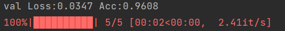

在一个只有300张的数据集，100张验证集的dataset上玩一玩（主要是熟悉一下代码，李沐的课程代码都在d2l中很少自己手写代码）

本项目为二分类问题，为了分别ants和bees：

## 创建Dataset

<!--more-->

```python
# 创建输入图像预处理类
class ImageTransform():
    def __init__(self,resize,mean,std):
        self.data_transform={
            'train':transforms.Compose(
                [
                    transforms.RandomResizedCrop(resize,scale=(0.5,1.0)),
                    transforms.RandomHorizontalFlip(),
                    transforms.ToTensor(),
                    transforms.Normalize(mean,std)
                ]
            ),
            'val':transforms.Compose(
                [
                    transforms.Resize(resize),
                    transforms.CenterCrop(resize),
                    transforms.ToTensor(),
                    transforms.Normalize(mean,std)
                ]
            )
        }

    def __call__(self,img,phase='train'):
        return self.data_transform[phase](img)
size=224
mean=(0.485,0.456,0.406)
std=(0.229,0.224,0.225)
# 创建保存蚂蚁和蜜蜂图片的文件路径列表变量
def make_datapath_list(phase='train'):
    rootpath='./pytorch_advanced-master/1_image_classification/data/hymenoptera_data/'
    target_path=osp.join(rootpath+phase+'/**/*.jpg')
    path_list=[]
    for path in glob.glob(target_path):
        path_list.append(path)
    return path_list

train_list=make_datapath_list(phase='train')
val_list=make_datapath_list(phase='val')

# 创建蚂蚁和蜜蜂的dataset
class Hdataset(data.Dataset):
    def __init__(self,file_list,transform=None,phase='train'):
        self.file_list=file_list
        self.transform=transform
        self.phase=phase

    def __len__(self):
        return len(self.file_list)

    def __getitem__(self, index):
        # 载入第index张图片
        img_path=self.file_list[index]
        img=Image.open(img_path)
        # 预处理
        img_transformed=self.transform(img,self.phase)

        # 从文件名抽取标签
        if self.phase=='train':
            label=img_path[77:81]
        elif self.phase=='val':
            label=img_path[75:79]

        # 将标签转化为数字
        if label=='ants':
            label=0
        elif label=='bees':
            label=1

        return img_transformed,label

train_dataset=Hdataset(file_list=train_list,transform=ImageTransform(size,mean,std),phase='train')
val_dataset=Hdataset(file_list=val_list,transform=ImageTransform(size,mean,std),phase='val')
```

## 创建DataLoader

```python
# 创建DataLoader
batch_size=32
train_dataloader=torch.utils.data.DataLoader(train_dataset,batch_size,True)
val_dataloader=torch.utils.data.DataLoader(val_dataset,batch_size,False)
dataloader_dict={'train':train_dataloader,'val':val_dataloader}
```

## 创建网络架构，优化器，loss函数

```python
# 创建网络模型
use_pretrained=True
net=models.vgg16(use_pretrained)
net.classifier[6]=nn.Linear(in_features=4096,out_features=2) # 用一个全连接层替代原来的分类器
net.train()

# 定义损失函数
loss=nn.CrossEntropyLoss()
# 设置优化器
# 由于我们使用的是训练好的VGG框架，因此只需要训练原先的classifier的参数即可
params_to_update=[]
update_param_names=['classifier.6.weight','classifier.6.bias']
for name, param in net.named_parameters():
    if name in update_param_names:
        param.requires_grad=True
        params_to_update.append(param)
    else:
        param.requires_grad=False
optimizer=optim.SGD(params_to_update,lr=0.01,momentum=0.9)
```

## 创建训练函数

```python
# 训练模型
def train_model(net,dataloader_dict,loss,optimizer,epochs):
    #  判断是否使用GPU
    device=torch.device('cuda:0' if torch.cuda.is_available() else 'cpu')
    print('使用GPU',device)
    net.to(device)
    for epoch in range(epochs):
        print('Epoch {}/{}'.format(epoch+1,epochs))
        print('------------')
        for phase in ['train','val']:
            if phase=='train':
                net.train()
            else:
                net.eval()
            epoch_loss=0.0
            epoch_corrects=0
            if epoch==0 and phase=='train':
                continue
            for inputs,labels in tqdm(dataloader_dict[phase]):
                inputs=inputs.to(device)
                labels=labels.to(device)
                # 初始化optimizer
                optimizer.zero_grad()
                # forward
                with torch.set_grad_enabled(phase=='train'):
                    outputs=net(inputs)
                    lost=loss(outputs,labels)
                    _,preds=torch.max(outputs,1)

                    # 训练时的反向传播
                    if phase=='train':
                        lost.backward()
                        optimizer.step()

                    epoch_loss+=lost.item()*inputs.size(0)
                    epoch_corrects+=torch.sum(preds==labels.data)
                    epoch_loss=epoch_loss/len(dataloader_dict[phase].dataset)
                    epoch_acc=epoch_corrects.double()/len(dataloader_dict[phase].dataset)
                    print('{} Loss:{:.4f} Acc:{:.4f}'.format(phase,epoch_loss,epoch_acc))
```

## 观察结果

```
train_model(net,dataloader_dict,loss,optimizer,5)
```

结果如下：



本人略微调了一下书中原文给的``lr``，然后进行了5个``epoch``的训练，``Acc``还是较为高的。

## 保存训练好的参数

```python
# 保存训练好的参数
save_path='./weights.pth'
torch.save(net.state_dict(),save_path)
# 导入参数
load_path='./weights.pth'
load_weights=torch.load(load_path)
net.load_state_dict(load_weights)
```
